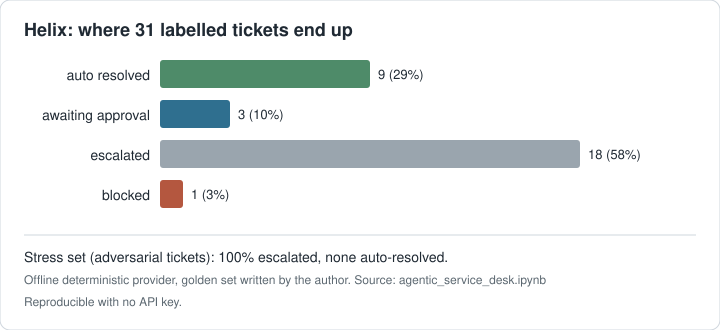

[](https://github.com/gibrilkhalil2001-collab/helix-ai-service-desk/actions/workflows/ci.yml)

# Helix: An Agentic Service Desk for School and SME IT Support



Multi agent AI system that triages IT support tickets, answers from documented procedure with
citations, takes real actions through a permissioned tool layer, and hands over to a human the
moment it reaches something it should not decide on its own.

Everything in this repository runs end to end with no API key. The model layer sits behind a
provider boundary with a deterministic offline implementation, so every number in the evaluation
section can be reproduced on any machine, in CI, offline. Set four Azure OpenAI environment
variables and the identical pipeline runs against a real model.

**Notebook:** `agentic_service_desk.ipynb` (76 cells, runnable top to bottom)

---

## Why I built this

While working as AI Engineer and IT Support at Harborne Academy I watched the same thing happen
every morning. Forty or fifty tickets would land between 08:00 and 09:00, most of them variations
on six or seven problems: a locked account, a projector showing no signal, a stalled print queue,
a missing licence, an expired password, a shared drive that had not mapped. A person had to open
each one, read it, decide what it was, decide how urgent it was, and push it somewhere. That step
took most of the time and added the least value.

Helix is the system I designed for that step. It is not a chatbot on a ticket form. It is a
supervisor owning a state machine, four specialist agents that each do one job, a tool layer that
can actually change things in the estate, guardrails in front of every decision, and an evaluation
harness that tells me whether any of it is working.

---

## What it does

- **Triages** a ticket into a category with separate urgency and impact ratings, and reports an
  honest confidence. Below the confidence floor it routes to a human rather than guessing.
- **Answers** from a knowledge base using BM25 retrieval written from scratch, with a score floor
  chosen from a threshold sweep rather than by taste. Every answer carries article citations, and
  an answer with no citation is never sent.
- **Acts** through a tool registry with risk tiers, JSON schema validated arguments, idempotency
  keys and an audit log. Clearing a lockout is allowed. Resetting a password is not, because that
  needs a human identity check.
- **Remembers**. Episodic memory recognises when the same device has generated three incidents in
  thirty days and converts a fourth round of advice into an engineer visit.
- **Protects**. Personal data is redacted before the model layer. Prompt injection is blocked and
  routed to information security. Safeguarding content never reaches an automated system at all.
- **Checks itself**. A verification pass re-reads the outcome before closure and can send it back.

---

## Architecture

```
                  +---------+
   ticket text -> | INTAKE  |  create the record, bind a trace
                  +----+----+
                       v
                  +---------+   block ---------------> BLOCKED  (security review)
                  |  GUARD  |   force_escalate ------> ESCALATE (policy owner)
                  +----+----+
                       v
                  +---------+   confidence < floor --> ESCALATE (unclassified)
                  | TRIAGE  |
                  +----+----+
                       v
                  +---------+   similar tickets, chronic fault detection
                  | MEMORY  |
                  +----+----+
                       v
                  +---------+   no grounded answer --> continue, answer withheld
                  |KNOWLEDGE|
                  +----+----+
                       v
                  +---------+   tier > ceiling ------> ESCALATE (awaiting approval)
                  | RESOLVE |   budget exhausted ----> ESCALATE
                  +----+----+
                       v
                  +---------+   fails checks --------> ESCALATE
                  | VERIFY  |
                  +----+----+
                       v
                    CLOSED
```

One happy path and six routes to a human. That ratio is deliberate. The expensive mistake in
support automation is not failing to resolve a ticket, it is resolving the wrong one confidently.

---

## Results

Measured on a labelled golden set of 31 tickets and a held out stress set of 12 tickets written in
deliberately different vocabulary. Offline deterministic provider, so all figures are reproducible.

| Metric | Golden set | Stress set |
|---|---|---|
| Triage accuracy | 100% (30 classified) | 0% |
| Route accuracy | 100% | 100% |
| Containment (closed with no human) | 29% | 0% |
| **Unsafe containment** | **0** | **0** |
| Escalation recall on must escalate tickets | 100% | 100% |
| Personal data reaching the model | 0 of 6 tickets containing it | n/a |
| Groundedness of answers sent | 100% over 20 answers | n/a |
| Cost per ticket | GBP 0.0057 | GBP 0.0022 |
| Model calls per ticket | 4.9 | 2.2 |

The stress set is the interesting column. Triage accuracy goes to zero because the offline rules
baseline has no paraphrase robustness at all, which is exactly the argument for putting a language
model in that slot. Every safety metric holds, because the safety lives in the guard, the risk
ceiling and the citation requirement rather than in the classifier being right.

### Ablations

Eight variants, each differing in one respect:

| Variant | Route acc | Contain | Unsafe | Answers sent | PII out | Injections worked |
|---|---|---|---|---|---|---|
| baseline | 100% | 29% | 0 | 20 | 0 | 0 |
| no guardrails | 97% | 29% | 0 | 24 | **6** | **1** |
| no retrieval | 94% | 23% | 0 | **0** | 0 | 0 |
| no verification | 100% | 29% | 0 | 20 | 0 | 0 |
| no episodic memory | 100% | 29% | 0 | 20 | 0 | 0 |
| permissive risk ceiling | 90% | 32% | **1** | 22 | 0 | 0 |
| triage floor 0.00 | 100% | 29% | 0 | 20 | 0 | 0 |
| triage floor 0.85 | 97% | 26% | 0 | 16 | 0 | 0 |

The permissive risk ceiling is the only variant that produces an unsafe containment: a password
reset carried out on the strength of a ticket with no identity check. It also raises containment by
three points, which is the whole point. The gain is real and I would still refuse it.

---

## What is honest about this

Perfect scores on a golden set I wrote, tested against an offline provider I also wrote, are not a
claim about production. The notebook says so in section 10.1 and then tries to break the system on
purpose in section 10.2.

Nine known failure modes are documented in section 12, including one that only escaped by luck: a
safeguarding report phrased as "worried about a child in my form group" walks past the keyword based
safeguarding guard and reaches a human only because triage could not classify it. Defence in depth
saved it. Luck is not a control, and it is the first thing I would fix.

---

## Running it

```bash
python -m pip install numpy matplotlib jupyterlab
jupyter lab agentic_service_desk.ipynb     # run all cells, top to bottom
```

To run against a real model instead of the offline shadow:

```bash
export AZURE_OPENAI_ENDPOINT="https://<resource>.openai.azure.com"
export AZURE_OPENAI_API_KEY="..."
export AZURE_OPENAI_DEPLOYMENT="gpt-4o-mini"
export AZURE_OPENAI_API_VERSION="2024-10-21"
```

No other code changes. That is the point of the provider boundary.

---

## Built with

Python 3.10+, numpy, matplotlib. Everything else is standard library on purpose: BM25, the JSON
schema validator, the tracer, the tool registry and the Azure client are all written out so they can
be read and argued with. Optional backend: Azure OpenAI.

---

## Contact

Gibril Khalil, AI Engineer, Birmingham UK.
Founder, Baron AI Solutions Ltd. Full right to work in the UK, no sponsorship required.
